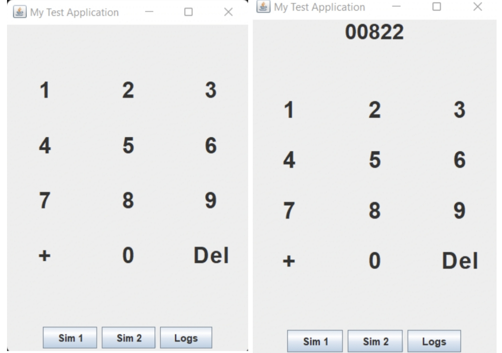
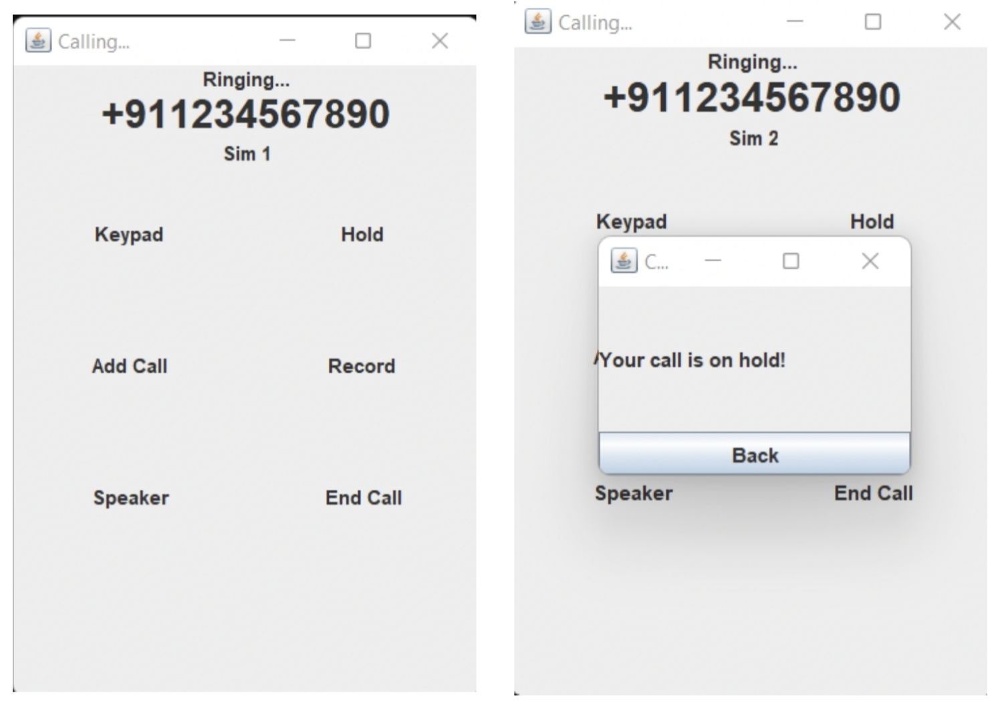
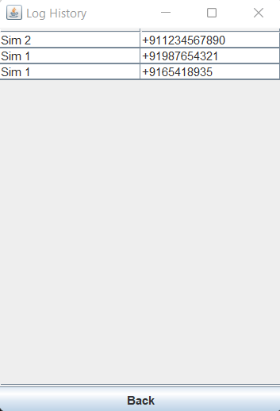

# SwingPractice
This is a Mobile Dialpad application built using Java Swing which is used for developing GUI.

## Usage
- Clone the repository or Download the .zip file from [here](https://github.com/kannangr21/SwingPractice/archive/refs/heads/master.zip).
- Extract the folder `SwingPractice-master` and navigate to the base root.
- In the terminal, run the command `java caller.SwingExampleOne`.

## Images of the Dialpad
Here are some of the Images of the application.

1. Dialpad with and without numbers.
  

2. Calling interface with buttons.
 

3. Call logs page.   

